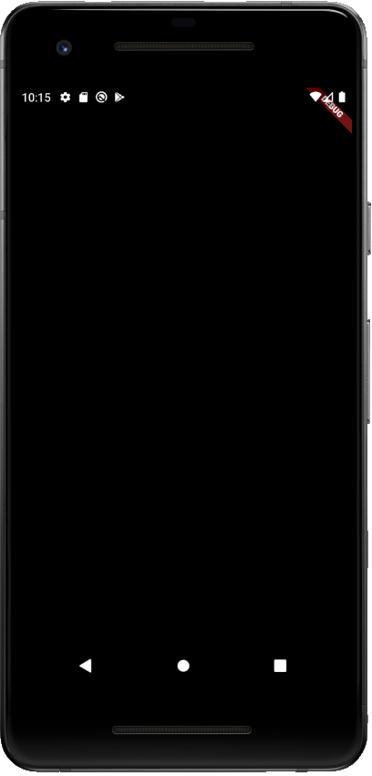

# Intro to Flutter - Lewis Capaldi App

Welcome to the [Intro to Flutter event](https://dsc.community.dev/events/details/developer-student-clubs-texas-am-university-presents-introduction-to-flutter-with-dsc-lead/#/) hosted by [DSC Texas A&M](https://dsc.community.dev/texas-am-university/)

Today's session will be a simple UI crash course. The app we'll be making is a Lewis Capaldi app.

### Screenshot

### Structure

* The app has been divided into steps.
* Each step has starter and solution code.
* You can access each code set using the respective branches.
* Also, each step has detailed TODOs along with explanations on why we're doing each TODO.

### How to follow this repo?

* Complete the given TODOs in order.
* Compare the starter and solution branches for each step. You can do this on GitHub or in Android Studio/VS Code.

[How to compare branches on GitHub](https://docs.github.com/en/free-pro-team@latest/github/committing-changes-to-your-project/comparing-commits#comparing-branches)

[How to compare branches on Android Studio](https://medium.com/better-programming/how-to-use-git-in-android-studio-part-2-93cec67b91b0#:~:text=Go%20to%20%E2%80%9CVSC%E2%80%9D%20%2D%3E,choose%20%E2%80%9CCompare%20with%20current%E2%80%9D.&text=A%20popup%20%E2%80%9CCompare%20feature%20with,to%20commits%2C%20files%20to%20files.)

[How to compare branches on Android Studio](https://stackoverflow.com/a/57833947/11547064)

### Steps

1. Initial setup

2. Text for Lewis Capaldi's quote

3. Lewis Capaldi's Image

4. Text for name and role

5. Social media icons

6. Buttons for concerts and merch

7. Finishing touches

### Skills Learned

* UI crashcourse
* Text
* Image
  * NetworkImage
* Column
* Row
* Center
* FlatButton
* IconButton